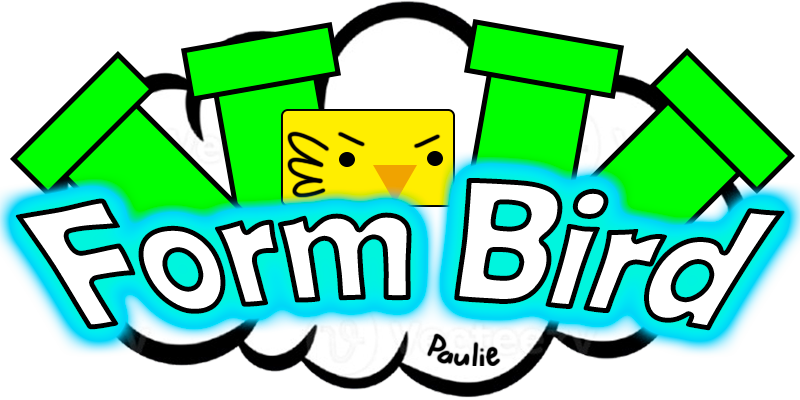
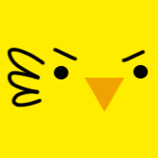

# FormBird

**FormBird** je jednoduchá, zábavná arkádová hra inspirovaná klasikou, kde hráč ovládá ptáka, který se musí vyhnout překážkám (trubkám), a sbírat skóre. Hra se vyznačuje jednoduchým ovládáním, kde jediným pohybem, který je potřeba ovládat, je **skok** (pomocí mezerníku).

## Jak to funguje

### Hlavní cíle hry:
- **Vyhnout se trubkám**: Pták se pohybuje vertikálně a musí se vyhýbat trubkám, které se pohybují horizontálně.
- **Skóre**: Za každý úspěšně přejitý prostor mezi trubkami se hráčovi přičítá skóre. Skóre se zobrazuje na levé straně obrazovky.

### Ovládání:
- **Skok**: Pomocí mezerníku (space bar) pták vyskočí. Skok se musí načasovat správně, aby se vyhnul trubkám.
- **Pauza a Konec hry**: Hru lze ukončit stiskem **Escape**.

### Hratelnost:
- Hra začíná po stisknutí tlačítka **Play** na hlavní obrazovce.
- Pták se začne pohybovat automaticky, a úkolem hráče je vyhnout se trubkám. Trubky se pravidelně objevují na obrazovce v různých intervalech.
- Čím déle hráč přežije, tím rychlejší budou trubky.
- Pokud pták narazí do trubky nebo padne na zem, hra končí a zobrazí se obrazovka s výsledky.

### Funkce:
- **Možnost změnit barvu ptáka a trubek**: Hráč si může přizpůsobit barvy hry podle svých preferencí.
- **Skóre**: Po každé hře je zobrazeno skóre, které lze nahrát do databáze, pokud hráč zadá své jméno.
- **Úspěchy**: Každých 10 dosažených skóre zvyšuje rychlost hry, což činí hru stále náročnější.

## Obrazovky

### Hlavní menu:
Na začátku hry se zobrazí hlavní menu, kde si můžete vybrat barvu ptáka a trubek.

### Hra v akci:
Hra se rozběhne, jakmile stisknete tlačítko **Play**. Pták se začne pohybovat a vyhýbat překážkám.
